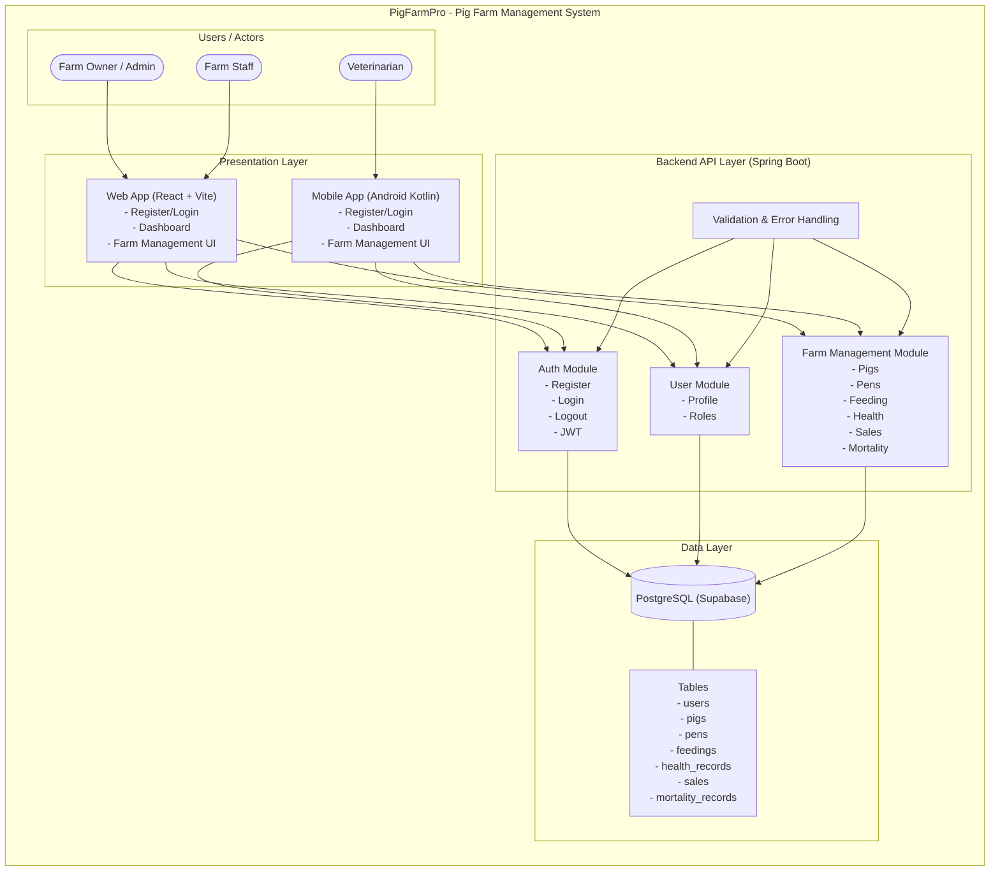

# System Architecture Diagram

```mermaid
flowchart LR
  subgraph System["PigFarmPro - Pig Farm Management System"]
    subgraph Actors["Users / Actors"]
      admin(["Farm Owner / Admin"])
      staff(["Farm Staff"])
      vet(["Veterinarian"])
    end

    subgraph Presentation["Presentation Layer"]
      web["Web App (React + Vite)\n- Register/Login\n- Dashboard\n- Farm Management UI"]
      mobile["Mobile App (Android Kotlin)\n- Register/Login\n- Dashboard\n- Farm Management UI"]
    end

    subgraph Backend["Backend API Layer (Spring Boot)"]
      auth["Auth Module\n- Register\n- Login\n- Logout\n- JWT"]
      user["User Module\n- Profile\n- Roles"]
      farm["Farm Management Module\n- Pigs\n- Pens\n- Feeding\n- Health\n- Sales\n- Mortality"]
      validation["Validation & Error Handling"]
    end

    subgraph Data["Data Layer"]
      db[("PostgreSQL (Supabase)")]
      tables["Tables\n- users\n- pigs\n- pens\n- feedings\n- health_records\n- sales\n- mortality_records"]
    end
  end

  admin --> web
  staff --> web
  vet --> mobile
  web --> auth
  web --> user
  web --> farm
  mobile --> auth
  mobile --> user
  mobile --> farm
  auth --> db
  user --> db
  farm --> db
  validation --> auth
  validation --> user
  validation --> farm
  db --- tables
```
